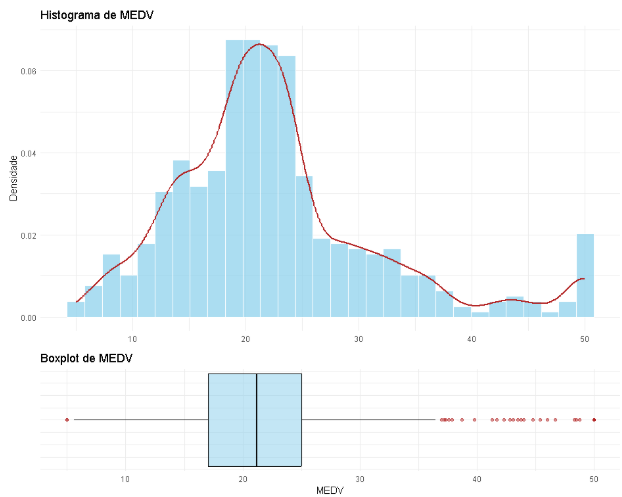
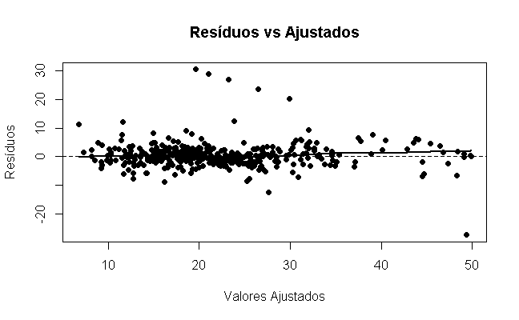
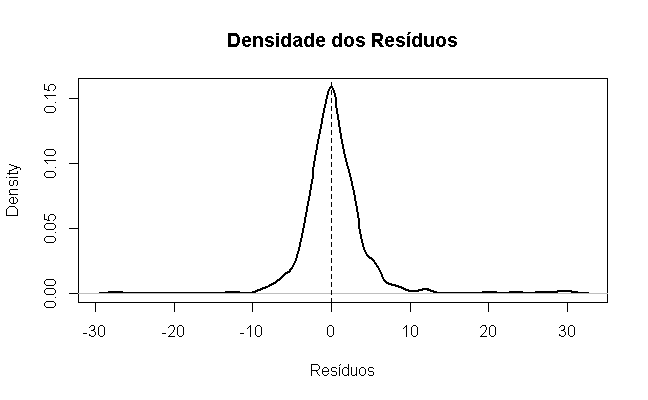

# robust-bayesian-tobit
Modelagem do Preço de Casas em Boston usando abordagem bayesiana em um modelo Tobit com distribuição T-Student

## Variáveis

- **CRIM:** Taxa de criminalidade *per capita* por cidade.
- **ZN:** Proporção de terrenos residenciais zoneados para lotes acima de 25.000 pés² (\~2.300 m²).
- **INDUS:** Proporção de acres ocupados por empresas não-varejistas (zonas industriais/comerciais) por cidade.
- **CHAS:** Variável binária do Rio Charles (1 se o terreno faz fronteira com o rio; 0 caso contrário).
- **NOX:** Concentração de óxidos nítricos (partes por 10 milhões).
- **RM:** Número médio de quartos por habitação.
- **AGE:** Proporção de unidades ocupadas pelos proprietários construídas antes de 1940.
- **DIS:** Distâncias ponderadas até cinco centros de emprego de Boston.
- **RAD:** Índice de acessibilidade às rodovias radiais.
- **TAX:** Taxa de imposto sobre a propriedade de valor total por US\$ 10.000.
- **PTRATIO:** Relação aluno-professor por cidade.
- **B:** Resultado da equação $B = 1000(Bk - 0,63)^2$, onde $Bk$ é a proporção de pessoas negras por cidade.
- **LSTAT:** Porcentagem da população de classe social baixa.

- **MEDV:** Valor médio das casas ocupadas pelos proprietários (em milhares de dólares — US\$ 1.000s).

## A variável MEDV
- Essa variável é censurada à direita. Valores maiores que 50 foram igualados a 50.

## Modelagem
- Por causa dessa censura, usar modelos comuns de Regressão (como regressão linear) não seria adequado. Então optamos por usar o Modelo Tobit (que é baseado na variável latente MEDV* , antes de ter seu valor cortado pela função MIN(MEDV*, 50))
- Entretanto, ao aplicar o modelo Tobit, foi verificado que a distribuição dos resíduos tinham caudas mais pesadas que a distribuição normal (que é assumida pelo Tobit).
- Essa cauda pesada era devido a presença de pontos influentes que haviam no dataset, então optamos pelo uso de um Modelo Robusto Tobit com erros de distribuição t;
- Fizemos essa modelagem usando a abordagem bayesiana;
- Apesar das limitações do modelo linear sob censura e heavy tails, usamos Stepwise Regression para selecionar um conjunto menor de variáveis. Após isso, aplicamos o modelo tobit (frequentista) nesse subconjunto de variáveis e selecionamos apenas as variáveis significativas;
- O conjunto final de variáveis foi: NOX + RM + DIS + PTRATIO + B + LSTAT + RM^2

## Análise do Fitting

O modelo teve bom ajuste;

## Análise no dataset de teste:
MAE : 3.05826
RMSE : 3.8978

## TO-DO:
- Analisar métricas bayesianas
- Analisar os coeficientes estimados
- Usar mais cadeias de markov
- Pesquisar outras formas de seleçao de variáveis (considerar fazer isso no próprio modelo bayesiano)
- Analisar os valores censurados
- 
